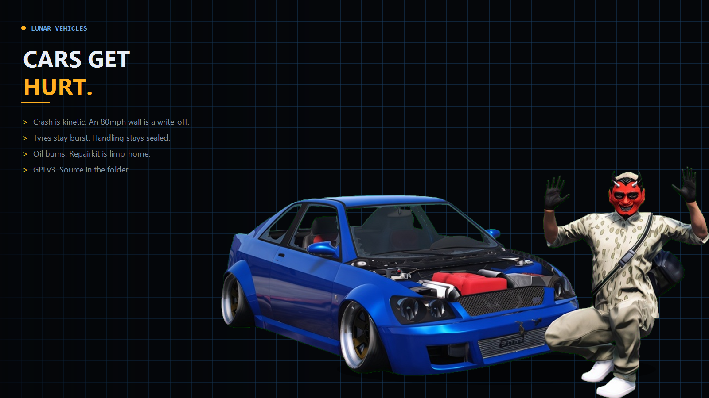

# lunar-vehicles

<p align="center">
  
</p>

QBCore **vehicle feel** — crash damage, burst tyres that stay burst, soft handling, oil, roadside kits. Logic lives in this resource. It does not patch qb-core.

**License:** [GNU GPL v3](LICENSE)  
**Version:** 1.2.0

Drag the `lunar-vehicles` folder into your resources. No escrow. No extra SQL. Owned cars persist into `player_vehicles.mods.lunarState`.

Upload **this folder** as the GitHub repo root (same as lunar-stashes). Paid Lunar jobs (dispatch, police, mechanic) stay on Tebex — this zip is the free companion.

## Install

1. Copy this folder into `resources` (keep the folder name `lunar-vehicles`).
2. In `server.cfg`:

```
ensure qb-core
ensure oxmysql
ensure lunar-vehicles
```

`qb-target` is optional (engine repair eye). `qb-inventory` is optional (`HasItem`). `ps-ui` is optional (Circle hack; skipped if missing). `qb-ambulancejob` is optional (laststand / death).

3. `ensure lunar-vehicles` (or restart the server).

Do not paste crash, handling, or oil code into qb-core, qb-weapons, or qb-inventory.

## Behaviour

- Drive any tracked class and handling is applied on top of the stock snapshot, then reapplied so other scripts cannot wipe it. Multipliers are **server-sealed** (see below).
- Hard hits use kinetic loss: `(speed drop in m/s)² × K`. An 80 mph wall is a write-off. The **car** will not explode; occupants still take damage.
- Write-off / `playerKillDelta` kills the driver for real. Stock qb-ambulancejob first-down is laststand; this script then finishes them so hospital death actually registers.
- Burst tyres are stored on `state.tyres` and reapplied every tick (GTA likes to inflate them). Native bursts are captured too.
- `repairkit` is a limp-home engine job. `advancedrepairkit` is a mechanic rebuild and reseats the tyres.
- Oil burns while the engine runs. Hold **Z** to peek the gauge (or it pops when low).
- Owned plates save into the same `mods` JSON as Lunar kit data (`lunarPerf`). Unowned cars stay session-only.

## Config

Buyer edits that are data: job name, item names, crash thresholds, handling multipliers.

| File | Purpose |
| --- | --- |
| `config.lua` | Crash, oil, repairs, safety, persist. Streamed to clients. |
| `config.handling.lua` | Drive / grip / kit multipliers. **Server only** — not in the client resource. |

| Key | Purpose |
| --- | --- |
| `Config.Crash` | Speed-drop thresholds, write-off, tyre / window smash, occupant hurt / kill |
| `Config.Crash.finishLaststand` | Hard crash finishes laststand (set `false` for laststand-only) |
| `Config.Safety` | Vehicle no-explode + tank floor. Occupants are **not** crash-proof |
| `Config.Handling` | `enabled`, `reapplyMs`, `sealRefreshMs` only |
| `Config.Tyres.wheels` | GTA corner ids (`0` FL, `1` FR, `4` RL, `5` RR) |
| `Config.Repairs` | Kit items, job lock, Circle, heal amounts, `fixTyres` |
| `Config.Oil` | Burn rates and gauge key |
| `Config.IgnoreClasses` | Skip bikes / boats / air / trains |

The 400 ms apply loop reads a **sealed snapshot** from the server (clamped), not `Config.Handling.global`. Patching the shared config table does not change what gets pushed. That is not anti-cheat: handling natives are still client-side. A menu can set them without this script. This resource just refuses to be the amplifier.

Mileage is stored in **miles**.

## Dependencies

| Resource | Required |
| --- | --- |
| `qb-core` | Yes |
| `oxmysql` | Yes (owned persist) |
| `qb-target` | Optional repairs |
| `qb-inventory` | Optional item check |
| `ps-ui` | Optional Circle |
| `qb-ambulancejob` | Optional laststand / death |
| `lunar-mechanic` | Optional kit grades (`lunarPerf`) |

Stock `mechanic` job is enough for advanced kits.

## Exports

```lua
exports['lunar-vehicles']:GetState(plate)          -- server
exports['lunar-vehicles']:SetState(plate, patch)   -- server
exports['lunar-vehicles']:ServiceOil(plate, grade, fill)
exports['lunar-vehicles']:GetClientState()         -- client
exports['lunar-vehicles']:RefreshHandling()        -- client
```

## Legal

- **Copyright (C) 2026 Lunar.** Licensed under the [GNU General Public License v3.0](LICENSE). See also [NOTICE](NOTICE).
- **No warranty.** Sections 15–16 of the GPL apply.
- **Not affiliated** with Rockstar Games, Take-Two Interactive, Cfx.re, Tebex, or the QBCore project.
- **Does not ship** GTA V files, streamed assets, or copies of qb-core.
- You need a lawful copy of GTA V to play FiveM. You follow Cfx.re / FiveM terms on your server.
- I am not a lawyer. This README is not legal advice.

If you distribute this resource (or a modified version), you must keep it under GPL-3.0 and include the source, LICENSE, and copyright notices. Do not wrap this Lua in FiveM escrow and call it closed-source.

## Layout

```
lunar-vehicles/
  LICENSE
  NOTICE
  README.md
  fxmanifest.lua
  config.lua
  config.handling.lua
  client/main.lua
  client/damage.lua
  client/handling.lua
  client/oil_gauge.lua
  client/repair.lua
  server/handling.lua
  server/main.lua
  html/index.html
  html/style.css
  html/app.js
  preview/hero.png
  preview/wreck.jpg
```
